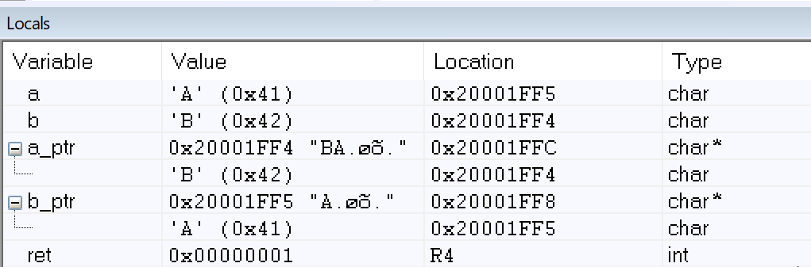
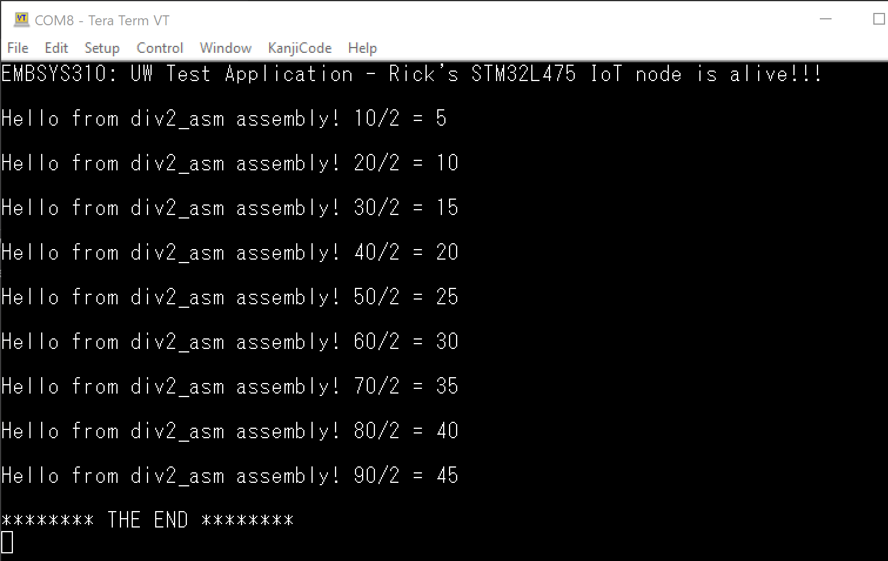
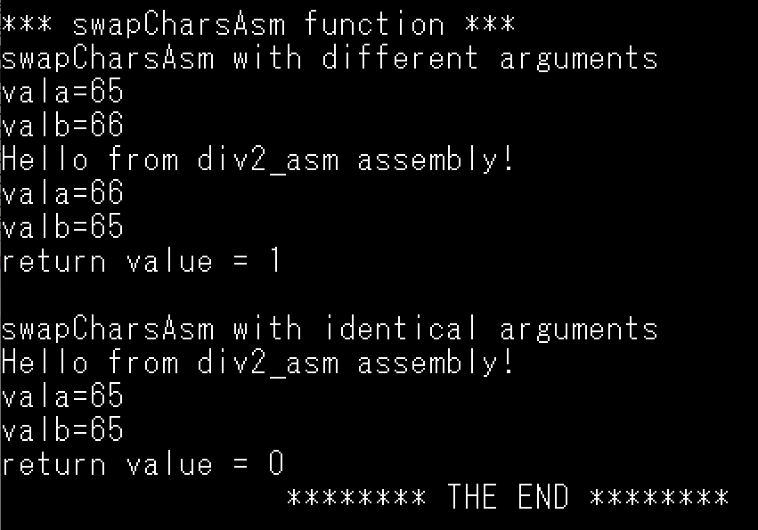
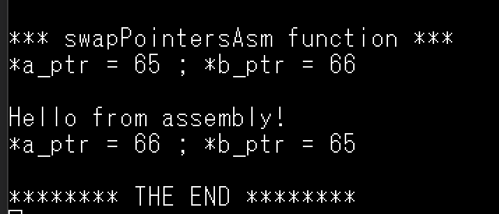

# ASSIGNMENT 05

##1. Create a function in “C” that allows swapping of two pointers.

    a. Explain what the “main” function does in order to setup the input arguments prior to 
    calling the swap_pointer() function?
        Two pointers are declared and initialized to point to two variables. The address of 
        the pointers are passed to the swap_pointers function.  The two arguments (pointers) 
        are stored in R0 and R1
        
    b. What are the values in R0 & R1 when swap_pointer() is called?
        R0 and R1 are storing the argument values for the swap_ptrs functions (addresses of 
        the pointers we are swapping)

    c. Share a screen shot of the local variables inside of “main” after the function swap_pointer() 
    returns showing the values of the pointers and what they are pointing to (similar to the picture below).

##2. Create a new file divAsm.s and add the file to the same HelloWorld project above.

    a. Start with the Assembly demo code shared in class (available under Module_06).

    b. Write the assembly code to take an input argument, divide it by 2, and return the result.

    c. Invoke the function “PrintString” from within divAsm before doing the division computation.

    d. Add a comment for every statement in your assembly function code.

    e. Invoke divAsm() inside of your main function in main.c

    f. Run your program on the board and capture a snapshot image of the output from TeraTerm showing the 
    result of the divAsm.

##3. Implement a swap function in assembly and call it “swapCharsAsm”:

    a. It takes as input two variables of char data type each and swaps the two chars.

    b. Add a comment for every statement in your assembly function code.

    c. Bonus: Return 0 if the two chars are identical; otherwise, return 1.

##4. Bonus: Implement the swap_pointer() function from #1 above in assembly and call it swapPointersAsm().

    a. Add a comment for every statement in your assembly function code.

    b. Invoke swapPointersAsm() from your main function main.c

    c. Run your program on the board and capture a snapshot image of the output from TeraTerm showing the 
    result of the swapPointersAsm() subroutine.

What to turn in and how:

- Check in all your homework in your repo under the folder “assignment05”.
  - #1 assignment05/swap_ptrs.c
  - #2 &3 assignment05/HelloWorld_Assembly/Src/main.c
    - main.c for problems 2 and 3 above
  - #2 assignment05/div2_asm.s
  - #3 assignment05/swapCharsAsm.s
  - #4 assignment05/swapPointersAsm.s

- Your folder should contain the following:

o Turn in your source code files only (for example: main.c, …etc.) and any other files that you have authored.

o Turn in answers to questions in markdown file format.

- Submit a link to your GitHub repo assignment:

o Ex: “https://github.com/<account_id>/embsys300/assignment05”
